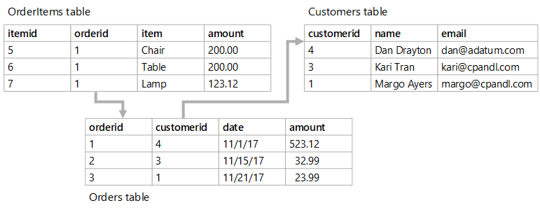

# Relational data

Relational data is data modeled using the relational model, whereby all data is expressed as tuples, and sets of tuples with the same headings form relations. A data store that organizes data using the relational model is referred to as a relational database. Relational databases use a tabular structure to materialize the relational model - that is they expose all the data as rows (tuples) in tables (relations). The database schema defines the columns (headings) of each table. Each column is defined with a name and a data type for all values stored in that column across all rows in the table.

Most relational databases use the Structured Query Language (SQL) language that enables a  declarative approach to querying. The query author focuses solely on authoring a query that shapes the desired result, allowing the relational database engine to decide how to actually execute the query. This is as opposed to the procedural approach used by other data stores, whereby the query program specifies the processing steps explicitly.  

Relational databases support varying forms of constraints, including:
- Primary key fields that are used to uniquely identify rows within a table.
- Foreign key fields that are used in one table to refer to a row in another table by referencing the primary key of other table. Foreign keys are used in maintaining referential integrity, ensuring that the referenced rows are not altered or deleted while the referencing row depends on them.
- Primary indexes are being used by the primary key to define the order of the data as it sits on disk.
- Secondary indexes provide an alternative combination of fields by which to quickly locate the desired rows, without having to re-sort the entire data on disk. The index structure used by relational databases typically includes B+ trees, R-trees and bitmaps. 
- Entity integrity contraints that use expressions to define constraints that limit the values that can be stored within a single column, or in relationship to values in other columns of the same row.

- Primary key and unique constraints, that are used to uniquely identify rows within a table.
- Foreign key constraints that are created on a table to reference a row in another table by referencing the primary key or alternate key of the other table. Foreign key constraints are used in maintaining referential integrity, disallowing changes that would result in a mismatch in foreign key column values between referenced and referencing tables.
- Primary and secondary indexes. Primary indexes, which are used by the primary key, define the order of the data as it sits on disk. Secondary indexes provide an alternative combination of fields by which to quickly locate the desired rows, without having to re-sort the entire data on disk. The index structure used by relational databases typically includes B+ trees, R-trees and bitmaps.
- Check constraints, also known as entity integrity constraints, use expressions to define constraints that limit the values that can be stored within a single column, or in relationship to values in other columns of the same row.

Additionally, relational databases allow for the storage of executable code routines in the form of stored procedures and functions, which enable a mixture of declarative and procedural approaches.

If data is non-relational or has requirements that are not suited to a relational database, consider a [Non-relational or NoSQL](./non-relational-data.md)data store.
