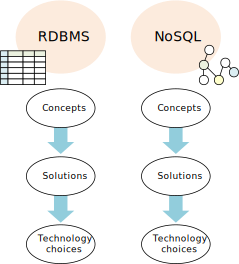

# Azure Data Architecture Guide

This guide presents a structured approach for designing data-centric solutions on Microsoft Azure. It is based on proven practices derived from customer engagements.

## Introduction

The cloud is changing the way applications are designed, including how data is processed and stored. Instead of a single general-purpose database that handles all of a solution's data, the _polyglot persistence_ approach is to use multiple, specialized databases and datastores &mdash; each optimized to provide specific capabilities needed by the solution. The perspective on data in the solution changes as a result. There are no longer multiple layers of business logic that read and write to a single data layer. Instead modern, polyglot persistence solutions are designed around a *data pipeline* that describes how data flows through a solution, where it is processed, where it is stored, and how it is consumed by the next component in the pipeline. 

## How this guide is structured

This guide is structure around a basic pivot: The distinction between *relational* or *structured* data and *non-relational* or *unstructured* (or semi-structured) data. 

Relational data is generally stored in a traditional RDBMS or a data warehouse. It has a pre-defined schema ("schema on write") with a set of constraints to maintain referential integrity. Most relational databases use Structured Query Language (SQL) for querying. Solutions that use relational databases include online transaction processing (OLTP) and online analytical processing (OLAP).

Non-relational data is any data that does not use the [relational model](https://en.wikipedia.org/wiki/Relational_model) used in traditional RDBMS systems. It can include key-value data, JSON data, graph data, time series data, and others. The term NoSQL refers collectively to databases that are designed to hold various types of non-relational data. (The term is not entirely accurate, because many non-relational data stores support SQL compatible queries.) Non-relational or NoSQL databases often come up in the contect of *big data* solutions. A big data architecture is designed to handle the ingestion, processing, and analysis of data that is too large or complex for traditional database systems. 

Within each of these two main pivots, the Data Architecture Guide contains the following sections:

- **Concepts.** Overview articles that introduce the main concepts you need to understand. 
- **Solutions.** A representative set of data solutions, including a discussion of the relevant Azure services and the appropriate architecture for the solution.
- **Technology choices.** Detailed comparions of various data technologies available on Azure, including open source options. Within each category, we describe the key selection criteria and a capability matrix, to help you choose the right technology option.

## Traditional RDBMS

### Concepts

- [Relational data](./concepts/relational-data.md) 
- [Transactional data](./concepts/transactional-data.md) 
- [Semantic modeling](./concepts/semantic-modeling.md) 

### Solutions

- [ETL / ELT](./solutions/data-pipeline.md) 
- [Data warehousing and data marts](./solutions/data-warehousing.md)
- [Online analytical processing (OLAP)](./solutions/online-analytical-processing.md)
- [Online transaction processing (OLTP)](./solutions/online-transaction-processing.md) 

## Big Data and NoSQL

### Concepts

- [Non-relational data](./concepts/non-relational-data.md)
- [Big data architectures](./concepts/big-data.md)
- [Advanced analytics](./concepts/advanced-analytics.md) 
- [Machine learning at scale](./concepts/machine-learning-at-scale.md)
- [Processing CSV and JSON files](./concepts/processing-csv-and-json-files.md)

### Solutions

- [Batch processing](./solutions/batch-processing.md)
- [Interactive data exploration](./solutions/interactive-data-exploration.md)
- [Natural language processing](./solutions/natural-language-processing.md)
- [Real time processing](./solutions/real-time-processing.md)
- [Search](./solutions/search.md)
- [Time series solutions](./solutions/time-series.md)

## Cross-cutting concerns

- [Data transfer](./technology-choices/data-transfer.md) 
- [Extending on-premises data solutions to the cloud](./cross-cutting/hybrid-on-premises-and-cloud.md) 
- [Monitoring data solutions](./cross-cutting/monitoring-data-solutions.md) 
- [Securing data solutions](./cross-cutting/secure-solutions.md) 
