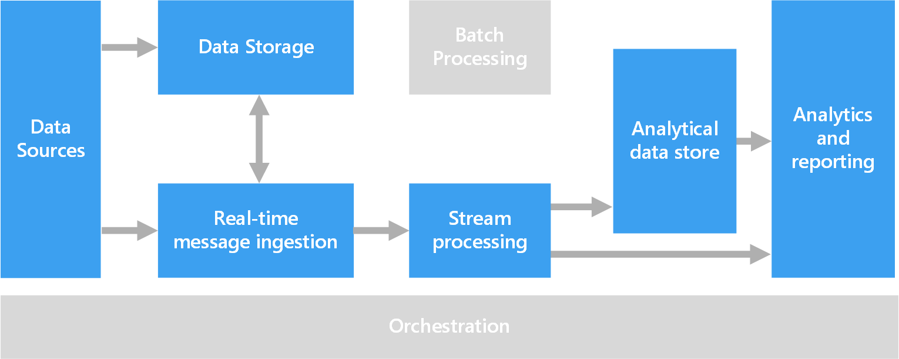

# Real time processing

Realtime processing deals with unbounded streams of data that are captured in real-time and processed with minimal latency to generate real-time (or near-real-time) reports or automated responses. For example, a real-time traffic monitoring solution might use sensor data to detect high traffic volumes, and which could be used to dynamically update a map to indicate congestion or to automatically initiate high-occupancy lanes or other traffic management systems.

Real-time processing is defined as the processing of a typically infinite stream of input data, whose time until results are ready is short &mdash; measured in milliseconds or seconds in the longest of cases. This incoming data typically arrives in an unstructured or semi-structured format, such as JSON, and has the same processing requirements as [batch processing](./batch-processing.md), but with shorter turnaround times to support real-time consumption.

Processed data is often written to an analytical data store, which is optimized for analytics and visualization. The processed data can also be ingested directly into the analytics and reporting layer for analysis, business intelligence, and real-time dashboard visualization.

## Technology choices

Typical technologies used in a real-time processing solution include:

### Real-time message ingestion

- Azure Event Hubs. Azure Event Hubs provide a message queuing solution for ingesting millions of event messages per second, and scaling the captured event data for processing by multiple consumers.
- Azure IoT Hubs. Azure IoT Hubs provide bi-directional communication between Internet-connected devices and a scalable message queue that can handle millions of simultaneously connected devices, with the ability to control device state and settings centrally.
- Apache Kafka. Kafka is an open source message queuing and stream processing application that can scale to handle millions of messages per second from multiple message producers, and route them to multiple consumers. Kafka is available in Azure as an HDInsight cluster type.

. [!NOTE]
> For a comparison of Azure Event Hubs and Azure IoT Hubs, see [Comparison of Azure IoT Hub and Azure Event Hubs](/azure/iot-hub/iot-hub-compare-event-hubs). 

### Data storage

- Azure Storage Blob Containers or Azure Data Lake Store. Incoming real-time data is usually captured in a message broker (see above), but in some scenarios, it can make sense to monitor a folder for new files and process them as they are created or updated. Additionally, many real-time processing solutions combine streaming data with static reference data, which can be stored in a file store. Finally, file storage may be used as an output destination for captured real-time data for archiving, or for further batch processing in a lambda architecture.

### Stream processing

- Azure Stream Analytics. Azure Stream Analytics is a service that you can use to run perpetual queries against an unbounded stream of data. The queries consume streams of date from storage or message brokers, filter and aggregate the data based on temporal windows, and write the results to sinks such as storage, databases, or directly to reports in Power BI.
- Storm. Apache Storm is an open source framework for stream processing that uses a topology of spouts and bolts to consume, process, and output the results from real-time streaming data sources. You can provision Storm in an Azure HDInsight cluster, and implement a topology in Java or C#.
- Spark Streaming. Apache Spark is an open source distributed platform for general data processing. Spark provides the Spark Streaming API, in which you can write code in any supported Spark language (including Java, Scala, and Python) to consume a discretized stream (DStream) of resilient distributed datasets (RDDs). From Spark 2.0, you can take advantage of the Spark Structured Streaming API, in which the streaming data is presented using the dataframe API – providing a simpler and more consistent programming model. Spark 2.0 is available in an Azure HDInsight cluster.

### Analytical data store

- SQL Data Warehouse, HBase, Spark, or Hive. Processed real-time data can be stored in a relational database such Azure SQL Data Warehouse, a NoSQL store such as HBase, or as files in distributed storage over which Spark, or Hive tables can be defined and queried.

### Analytics and reporting:

- Azure Analysis Services, Power BI, and Microsoft Excel. Processed real-time data that is stored in an analytical data store can be used for historical reporting and analysis in the same way as batch processed data. Additionally, Power BI can be used to publish real-time (or near-real-time) reports and visualizations from analytical data sources where latency is sufficiently low, or in some cases directly from the stream processing output.

In a purely real-time solution, most of the processing orchestration is managed by the message ingestion and stream processing components. However, in a lambda architecture that combines batch processing and real-time processing, you may need to use an orchestration framework such as Azure Data Factory or Apache Oozie and Sqoop to manage batch workflows for captured real-time data.

